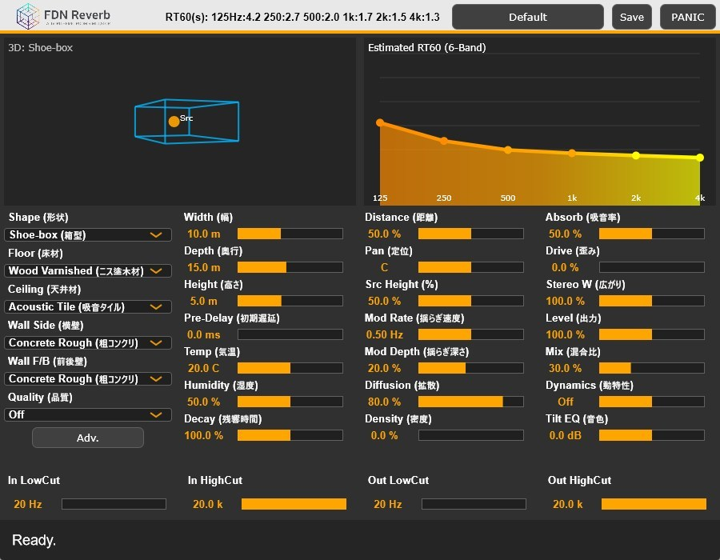

# FDN Reverb

  
  
<i>Advanced 16-Channel Physics-Based Reverb & SFX Engine</i>

---

---
## 🚀 Overview

**FDN Reverb** は、16チャンネルのフィードバック・ディレイ・ネットワーク（FDN）を核とした、物理音響シミュレーター兼SFXエフェクト・エンジンです。

34種類の実在・架空のマテリアル、7種類の空間形状、そして気温・湿度による空気吸収シミュレーションを搭載。現実のホールトーンから、プラズマや筋肉、声道といった異界のサウンドまでを1台で生成します。

---

## ✨ Features

* **16-Band FDN Engine**: 16本の独立した遅延回路が相互に干渉し、密度の高い残響を生成。
* **Material Modeling**: コンクリート、木材、大理石から「プラズマ」「筋肉」といった特殊素材まで34種類をシミュレート。
* **Physical Atmosphere**: 気温と湿度に基づき、高域の空気吸収（周波数依存の減衰）をリアルタイム演算。
* **Dynamics Control**: Ducking（ダッキング）およびBloom（ブルーム）機能を内蔵。サイドチェイン不要でリバーブの定位を制御。
* **SFX Mode**: 床素材に特殊素材を選択することで、物理演算を超越した「異形」のサウンドへと変貌。
* **Visual Feedback**: リアルタイム3Dルーム・ビジュアライザーと6バンドRT60特性グラフを搭載。
* **Modern Workflow**: ワンノブでトーンを決定するTilt EQ、入出力フィルタ、高品質オーバーサンプリング完備。

---

## 💿 Downloads & Installation

### 📥 Download

最新のビルド済みプラグイン（VST3/AU）は、以下の **Releases** ページからダウンロードしてください。

👉 **[Download FDN Reverb v1.0.0 (GitHub Releases)](https://www.google.com/search?q=https://github.com/YOUR_USER_NAME/YOUR_REPO_NAME/releases)**

### 🛠 Installation

1. ダウンロードしたファイルを解凍します。
2. OSごとのプラグインフォルダに移動させてください。
* **Windows**: `C:\Program Files\Common Files\VST3`

---

## 📖 Documentation

操作方法の詳細や、各マテリアルの解説については、以下の公式オンラインマニュアルおよびリファレンスを参照してください。

* 📘 **[FDN Reverb 公式ユーザーマニュアル](./FDN_Reverb_Basic_Guide.pdf)**
* 📚 **[マテリアル＆パラメータ・リファレンス](./FDN_Reverb_CompleteReferenceGuide.pdf)**

---

## 🔧 Technical Details (for Developers)

このプロジェクトは **C++ / JUCE Framework** を使用して開発されています。

### Build Requirements

* Projucer (JUCE 7.0+)
* Visual Studio 2022 (Windows) / Xcode (macOS)
* C++17 compliant compiler

---

## 📄 License

詳細は [LICENSE](https://www.google.com/search?q=./LICENSE) ファイルを参照してください。
---
